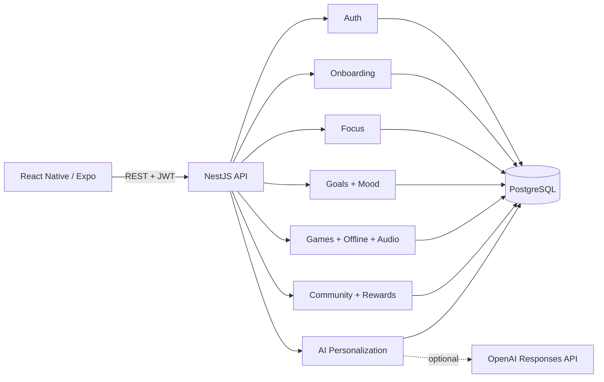

# Mentis AI - System Architecture

## Architectural style

Mentis uses a modular monolith rather than microservices. This is deliberate: the project has clear domains but does not have production-scale traffic that would justify Kafka, distributed transactions or service orchestration.

## Why modular monolith

- one deployable backend
- easier local development
- simpler transactions around XP/activity updates
- clear NestJS module boundaries
- can split modules later if actual scale requires it

## Data ownership

- Auth owns users and refresh tokens.
- Onboarding owns initial habits, assessment and starter plan.
- Focus owns focus session lifecycle.
- Wellness owns mood and personal goals.
- Content owns games, offline packs and audio catalog.
- Community owns leaderboards, challenges and collectible rewards.
- AI reads permitted high-level user activity and creates daily/weekly guidance.

## AI safety and reliability

The mobile client never calls the AI provider directly. NestJS is the policy boundary. If the external provider fails, rule-based guidance is returned so the app remains demonstrable and honest.

## Native app blocking

Android OS-level blocking is deliberately not coupled to the core focus-session domain. The backend stores the user's intent/session regardless of whether a device-specific restriction module exists. This prevents native permission complexity from breaking the main application.
